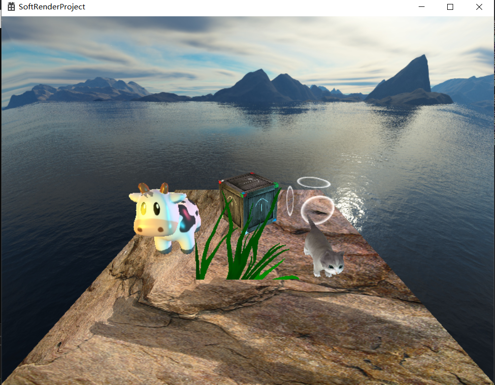

# SoftRender



本工程是学习Games101闫令琪大神的图形学课程之后，针对前五章内容做的练习。实现了前向渲染管线的基本流程，主要包括：mvp变换，blin-phone光照模型，顶点动画，alphablend, alphatest，shadowmapping等。

这个工程只做学习使用，没做任何优化，所以帧率比较吓人。

下面是一些约定和说明：

绘制使用的GDI的API，所以只能在windows下运行。

我使用的是vs2019，默认c++ 14。

使用右手坐标系，列矩阵，和unity不太一样。

1 材质定义

​	通过res/material下的.mat文件定义材质

```json
tex:cow	贴图
cubeMap:skybox 环境贴图
color:1,1,1,1	diffuse color
alphaTest:0		alphatest开关，1开启，0 关闭。下同
alphaBlend:0
zWrite:1
zTest:1
alphaClip:0.5	alpha test 裁剪系数
alphaBlendOp:2,1	alpha blend 混合方式，具体参见material.h中枚举声明
vs:blin-phone	vertex shader 
ps:blin-phone	frag shader
cull:0	背面剔除 0 front 1 back 2 off
```
2 shader定义

​	偷懒没有专门的shader语言，用c++生写在shaders.cpp文件中。比较简陋，看一眼就能明白怎么扩展。

3 其他资源目录

​	res/mesh	mesh目录，目前只支持obj；

​	res/tex	贴图文件目录，目前支持bmp和png。

​	res/tex/cubemap 环境贴图目录，同一组cubemap使用相同的前缀。

4 场景定义

​	同样在scene.cpp中生写的，但是很容易扩展成配置文件。